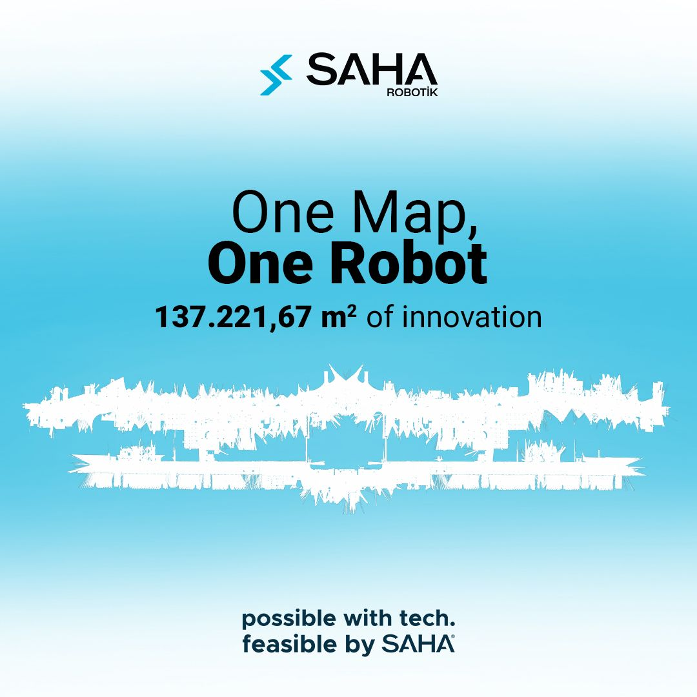

  

  <a style="font-size:1.4em; color:#4dabff!important; text-decoration:none; font-weight:600;" href="https://github.com/saha-robotics/" target="_blank"><strong>GitHub</strong></a> 
  <a style="font-size:1.4em; color:#4dabff!important; text-decoration:none; font-weight:600;" href="https://saharobotik.com/tr/" target="_blank"><strong>saharobotik.com</strong></a> 
  <a style="font-size:1.4em; color:#4dabff!important; text-decoration:none; font-weight:600;" href="https://www.linkedin.com/company/saha-robotik/posts/?feedView=all" target="_blank"><strong>LinkedIn</strong></a> 
  <a style="font-size:1.4em; color:#4dabff!important; text-decoration:none; font-weight:600;" href="https://www.instagram.com/saharobotik/" target="_blank"><strong>Instagram</strong></a>

  <!-- Company Overview -->
  <h2 id="overview">Company Overview</h2>
  
The company is a Turkish startup producing autonomous waiter and cargo robots in the Bilişim Vadisi tech park.

  <!-- Key Contributions -->
  <h2 id="contributions">Key Contributions</h2>
  <ul>
    <li>Actively using ROS2, C++, and Python.</li>
    <li>Leading the localization and mapping system development.</li>
    <li>Maintaining control and navigation systems for 150+ robots operating 24/7.</li>
    <li>Developed obstacle detection algorithms using 2D LiDAR to estimate trajectories of dynamic and static objects.</li>
    <li>Managed project lifecycle for the Istanbul Airport autonomous guide-robot:</li>
    <li>Only autonomous guide robot in Turkey, operating 24/7 with a daily travel of ≥25 km (map size: 187,514 m²).</li>
  </ul>

  

	<h3 style="font-size: 2.4em;">Service robot in Live usage</h3>
    

    
	

		Click the image to watch the video on YouTube.
	

  

  

  	<h3 style="font-size: 2.4em;">Live usage videos from istanbul Airport</h3>
    

    
	

		Click the image to watch the video on YouTube.
	

    
	

		Click the image to watch the video on YouTube.
	

  

  

  	<h3 style="font-size: 2.4em;">Istanbul Airport Map</h3>
    

    
    
Visual map of the Istanbul Airport coverage area for the autonomous guide-robot project.

  

  

  	<h3 style="font-size: 2.4em;">Azerbaijan ROS training program</h3>
    

    As lead of the company's ROS training program, I first provided remote instruction over the course of one month to university
    students in Azerbaijan. After the remote phase, I traveled to Azerbaijan to deliver in-person training sessions. During the visit,
    I also attended and evaluated the students' project presentations, which were based on the knowledge they had gained
    throughout the training
    

    

  	<h3 style="font-size: 1.2em;"><strong>Information:</strong> <a href="https://www.linkedin.com/feed/update/urn:li:activity:7315382416527822851/" target="_blank">From project</a>  </h3>
    
  

