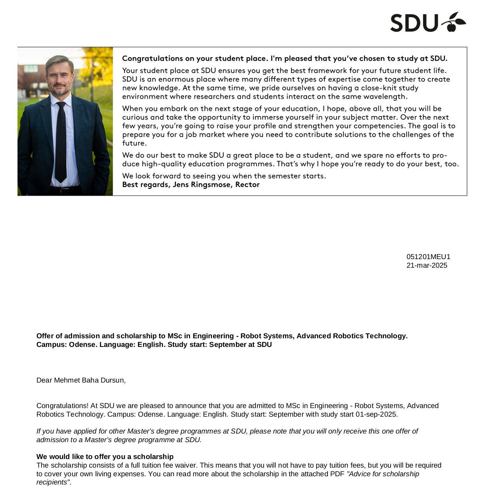

<!-- Main -->

<!-- One -->
<section id="one">
	

		<header class="major">
			<h1>MSC IN ENGINEERING - ROBOT SYSTEMS, ADVANCED ROBOTICS TECHNOLOGY University of Southern Denmark</h1>
		</header>

<!-- Content -->

I was awarded a full-scholarship for the Master's programme in Advanced Robotics at the University of Southern
Denmark, which I will begin on September 1, 2025.

Scholarship Proof.

<!-- two -->
<section id="two">
	

		<header class="major">
			<h1>Project Details</h1>
		</header>

